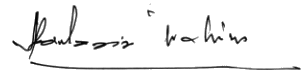

```{r setup, include=FALSE}
knitr::opts_chunk$set(echo = FALSE, comment=NA)

library(kableExtra)
library(mongolite)
library(dplyr)

# Connect to the database
# mongodb://[username:password@]host1[:port1]/?authSource=user-data

con <- readLines(con=".url.txt")
db <- mongolite::mongo(collection="minit", db="rafoc", url=con)
minit <- db$find('{"Siri": "24", "Jenis": "agm"}')

```

\textbf{\underline{MINIT MESYUARAT AGUNG TAHUNAN `r paste0("20",minit$Siri)` PADA `r minit$Tarikh` JAM 1000}} \newline \textbf{\underline{DI BILIK MINDA1, WISMA PERWIRA ATM, KUALA LUMPUR}}

### HADIR

Lihat Kembaran A

### AGENDA 1: `r minit$Agenda_1$Perkara`

```{r agenda 1, echo=FALSE}
paste("@.  ",minit$Agenda_1$Keterangan) %>% 
  kbl(col.names = "","html", booktabs = T) %>% 
  kable_styling(full_width = TRUE,position = "left")
paste("@.  Keputusan.",minit$Agenda_1$Keputusan) %>% 
  kbl(col.names = "","html", booktabs = T) %>% 
  kable_styling(full_width = TRUE,position = "left")

```

### AGENDA 2: `r minit$Agenda_2$Perkara`

```{r agenda 2, echo=FALSE}
paste("@.  ",minit$Agenda_2$Keterangan) %>% 
  kbl(col.names = "","html", booktabs = T) %>% 
  kable_styling(full_width = TRUE,position = "left")
paste("@.  Keputusan.",minit$Agenda_2$Keputusan) %>% 
  kbl(col.names = "","html", booktabs = T) %>% 
  kable_styling(full_width = TRUE,position = "left")
```

### AGENDA 3: `r minit$Agenda_3$Perkara`

```{r agenda 3, echo=FALSE}
paste("@.  ",minit$Agenda_3$Keterangan)  %>% 
  kbl(col.names = "","html", booktabs = T) %>% 
  kable_styling(full_width = TRUE,position = "left")
paste("@.  Keputusan.",minit$Agenda_3$Keputusan) %>% 
  kbl(col.names = "","html", booktabs = T) %>% 
  kable_styling(full_width = TRUE,position = "left")

```

### AGENDA 4: `r minit$Agenda_4$Perkara`

```{r agenda 4, echo=FALSE}
paste("@.  ",minit$Agenda_4$Keterangan) %>% 
  kbl(col.names = "","html", booktabs = T) %>% 
  kable_styling(full_width = TRUE,position = "left")
paste("@.  Keputusan.",minit$Agenda_4$Keputusan) %>% 
  kbl(col.names = "","html", booktabs = T) %>% 
  kable_styling(full_width = TRUE,position = "left")

```

### AGENDA 5: `r minit$Agenda_5$Perkara`

```{r agenda 5, echo=FALSE}
paste("@.  ",minit$Agenda_5$Keterangan) %>% 
  kbl(col.names = "","html", booktabs = T) %>% 
  kable_styling(full_width = TRUE,position = "left")
paste("@.  Keputusan.",minit$Agenda_5$Keputusan) %>% 
  kbl(col.names = "","html", booktabs = T) %>% 
  kable_styling(full_width = TRUE,position = "left")

```

### AGENDA 6: `r minit$Agenda_6$Perkara`

```{r agenda 6, echo=FALSE}
paste("@.  ",minit$Agenda_6$Keterangan)  %>% 
  kbl(col.names = "","html", booktabs = T) %>% 
  kable_styling(full_width = TRUE,position = "left")

```

### AGENDA 7: `r minit$Agenda_7$Perkara`

```{r agenda 7, echo=FALSE}
paste("@.  ",minit$Agenda_7$Keterangan)  %>% 
  kbl(col.names = "","html", booktabs = T) %>% 
  kable_styling(full_width = TRUE,position = "left")

```

### PENUTUP

```{r Penutup, echo=FALSE}
paste("@.  ",minit$Penutup) %>% 
  kbl(col.names = "","html", booktabs = T) %>% 
  kable_styling(full_width = TRUE,position = "left")
```

 \hspace{2.5cm}{width="25%"}    
Disediakan Oleh:.................................   

 \hspace{3cm}Kol Hamdan Bin Yaccob (B)

 \hspace{2.5cm}{width="35%"}  
Diluluskan Oleh:.................................  

 \hspace{2.5cm}Lt Jen Dato' Sri Abdul Aziz Bin Ibrahim (B)

```{r Disediakan, eval=FALSE, include=FALSE}
paste("Disediakan Oleh:",minit$Disediakan) %>% 
  kbl(col.names = "","html", booktabs = T) %>% 
  kable_styling(full_width = TRUE,position = "left")
paste("Diluluskan Oleh:",minit$Diluluskan) %>% 
  kbl(col.names = "","html", booktabs = T) %>% 
  kable_styling(full_width = TRUE,position = "left")
```
\newpage

### Kembaran A

```{r Kembaran A, echo=FALSE}

paste(minit$Kembaran) %>% 
  kbl(col.names = "","html", booktabs = T) %>% 
  kable_styling(full_width = TRUE,position = "left")

```
