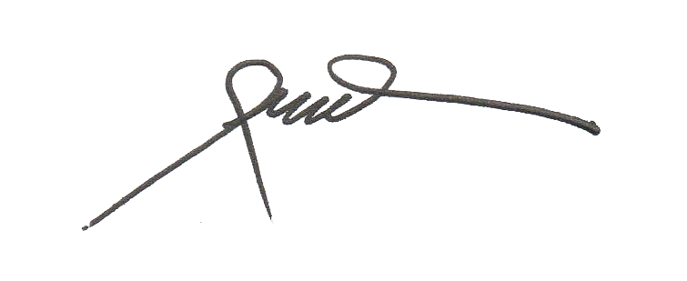
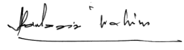

\textbf{\underline{MINIT MESYUARAT JAWATANKUASA SIRI `r minit$Siri` PADA `r toupper(format(as.Date(minit$Tarikh,format = "%d/%m/%y"),"%d %b %Y"))` JAM 1000}} \newline \textbf{\underline{DI SERAMBI WISMA PERWIRA ATM, KUALA LUMPUR}}

### HADIR

```{r hadir}
lst <- tibble("Nama"=unlist(minit$Hadir$Nama),"Singkatan"=unlist(minit$Hadir$Singkatan),"Jawatan"=unlist(minit$Hadir$Jawatan)) 

# print Nama, Singkatan, Jawatan with fixed column width 
lst %>%  
  kbl(booktabs = T,longtable = TRUE) %>% 
  kable_styling(latex_options = "hold_position",position = "left") %>% 
  column_spec(1, width = "9.5cm") %>%
  column_spec(2, width = "2cm") %>%
  column_spec(3, width = "5cm")
```

### TIDAK HADIR (DENGAN MAAF)

```{r tidak hadir}
nst <- tibble("Nama"=unlist(minit$Tidak_hadir$Nama),"Singkatan"=unlist(minit$Tidak_hadir$Singkatan),"Jawatan"=unlist(minit$Tidak_hadir$Jawatan))
nst %>% 
  kbl(booktabs = T) %>% 
  kable_styling(latex_options = "hold_position",position = "left") %>% 
  column_spec(1, width = "9.5cm") %>%
  column_spec(2, width = "2cm") %>%
  column_spec(3, width = "5cm")
```

\newpage

### AGENDA 1: `r minit$Agenda_1$Perkara`

```{r agenda 1, echo=FALSE}
paste("@.  ",minit$Agenda_1$Keterangan) %>% 
  kbl(col.names = "","html", booktabs = T) %>% 
  kable_styling(full_width = TRUE,position = "left")
paste("@.  **Keputusan**.",minit$Agenda_1$Keputusan) %>% 
  kbl(col.names = "","html", booktabs = T) %>% 
  kable_styling(full_width = TRUE,position = "left")

```

### AGENDA 2: `r minit$Agenda_2$Perkara`

```{r agenda 2, echo=FALSE}
paste("@.  ",minit$Agenda_2$Keterangan) %>% 
  kbl(col.names = "","html", booktabs = T) %>% 
  kable_styling(full_width = TRUE,position = "left")
paste("@.  **Keputusan**.",minit$Agenda_2$Keputusan) %>% 
  kbl(col.names = "","html", booktabs = T) %>% 
  kable_styling(full_width = TRUE,position = "left")
```

### AGENDA 3: `r minit$Agenda_3$Perkara`

```{r agenda 3, echo=FALSE}
paste("@.  ",minit$Agenda_3$Keterangan)  %>% 
  kbl(col.names = "","html", booktabs = T) %>% 
  kable_styling(full_width = TRUE,position = "left")
paste("@.  **Keputusan**.",minit$Agenda_3$Keputusan) %>% 
  kbl(col.names = "","html", booktabs = T) %>% 
  kable_styling(full_width = TRUE,position = "left")

```

### AGENDA 4: `r minit$Agenda_4$Perkara`

@.   **Pendaftaran ahli**. Jumlah ahli pada 31 Dis 2023 adalah 962. Jumlah ahli berakhir `r format(Sys.Date(),"%d %b %Y")` adalah `r nrow(rs) + 962`, tambahan `r nrow(rs)` ahli. Pengesahan pendaftaran telah disampaikan secara emel.    

```{r agenda 4, echo=FALSE}
paste("@.  ",minit$Agenda_4$Keterangan) %>% 
  kbl(col.names = "","html", booktabs = T) %>% 
  kable_styling(full_width = TRUE,position = "left")
paste("@.  **Keputusan**.",minit$Agenda_4$Keputusan) %>% 
  kbl(col.names = "","html", booktabs = T) %>% 
  kable_styling(full_width = TRUE,position = "left")

```

### AGENDA 5: `r minit$Agenda_5$Perkara`

```{r agenda 5, echo=FALSE}
paste("@.  ",minit$Agenda_5$Keterangan) %>% 
  kbl(col.names = "","html", booktabs = T) %>% 
  kable_styling(full_width = TRUE,position = "left")
paste("@.  **Keputusan**.",minit$Agenda_5$Keputusan) %>% 
  kbl(col.names = "","html", booktabs = T) %>% 
  kable_styling(full_width = TRUE,position = "left")

```

### AGENDA 6: PERKARA-PERKARA BAHARU DARIPADA AJK

```{r agenda 6, echo=FALSE}
paste("@.  ",minit$Agenda_6$Keterangan)  %>% 
  kbl(col.names = "","html", booktabs = T) %>% 
  kable_styling(full_width = TRUE,position = "left")

```

### PENUTUP

```{r Penutup, echo=FALSE}
paste("@.  ",minit$Penutup) %>% 
  kbl(col.names = "","html", booktabs = T) %>% 
  kable_styling(full_width = TRUE,position = "left")
```

\newpage
\hspace {2.5cm}{width="27%"}    
Disediakan Oleh:.................................   
\hspace {2.5cm}Kol Hamdan Bin Yaccob (B)

\hspace {5.5cm}{width="35%"}  
Diluluskan Oleh:.................................  
\hspace {2.5cm}Lt Jen Dato' Sri Abdul Aziz Bin Ibrahim (B)

```{r Disediakan, eval=FALSE, include=FALSE}
paste("Disediakan Oleh:",minit$Disediakan) %>% 
  kbl(col.names = "","html", booktabs = T) %>% 
  kable_styling(full_width = TRUE,position = "left")
paste("Diluluskan Oleh:",minit$Diluluskan) %>% 
  kbl(col.names = "","html", booktabs = T) %>% 
  kable_styling(full_width = TRUE,position = "left")
```

### KEMBARAN-KEMBARAN: 

```{r kembaran, echo=FALSE}
paste("",minit$Kembaran$Perkara)  %>% 
  kbl(col.names = "","html", booktabs = T) %>% 
  kable_styling(full_width = TRUE,position = "left")

```

